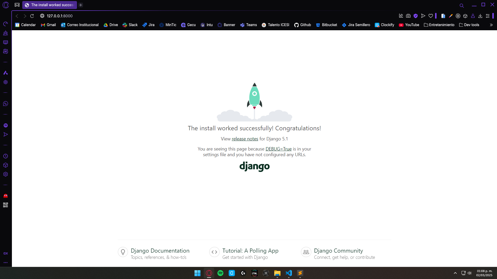
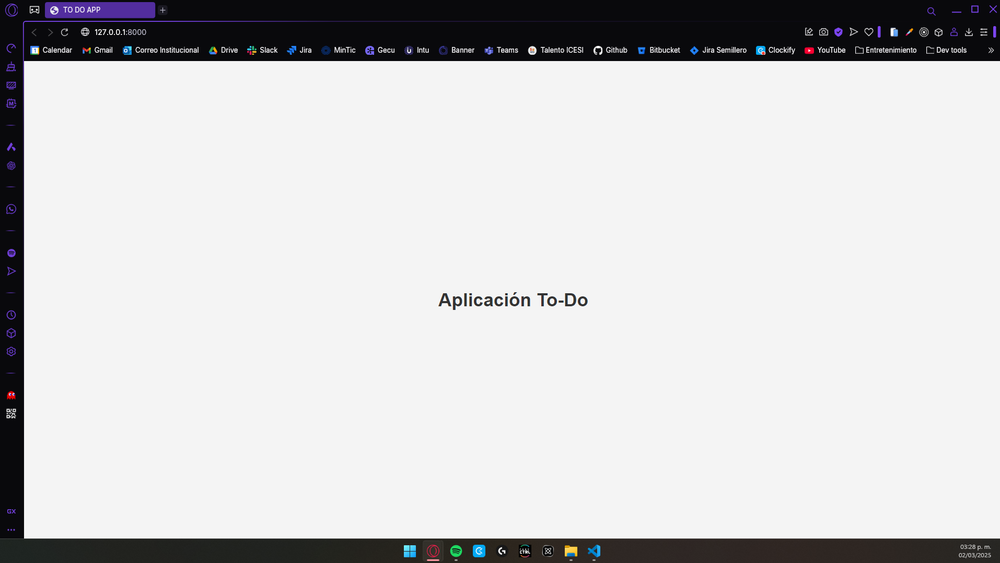

# Django TODO tutorial

## About

En este repo encontrarás un ejemplo básico de cómo construir una aplicación web, usando el framework de Python **Django**, para la gestión de tareas por hacer.

En este documento _README_ podrás ver los pasos que debes seguir para construir la aplicación por tu cuenta. 

## Pasos

### Creación del proyecto

Para inicializar el proyecto deberás seguir estos pasos:

1. Crear entorno virtual de Python

    Crear un entorno virtual en Python te permite trabajar en un ambiente aislado, gestionando de manera independiente las dependencias de cada proyecto. Esto evita conflictos entre versiones de librerías y garantiza un entorno más ordenado y controlado.

    Usa este comando para crearlo:

    ```bash
    python -m venv venv
    ```

    > **Nota:** El entorno puede tener el nombre que desees. En este caso, uso `venv` por convención. Además, es necesario que crees el entorno en la carpeta raíz del proyecto.

2. Activar el entorno virtual

    Una vez creado el entorno virtual, es preciso activarlo dentro de la consola que usarás para manejar y ejecutar tu proyecto. 

    Usa este comando para activarlo:

    ```bash
    ./venv/Scripts/activate
    ```

    > **Nota:** Reempla `venv` con el nombre que hayas escogido para tu entorno.

3. Seleccionar Python Interpreter

    Una vez creado, y activado, el entorno virtual, es importante asegurarse de que tu editor o IDE utilice el intérprete correcto. Esto garantiza que las dependencias instaladas en el entorno virtual sean reconocidas y usadas en tu proyecto.

    En Visual Studio Code (VS Code) debes hacer lo siguiente:

    - Abrir el **Command Palette** presionando `Ctrl + Shift + P`.
    - Escribir "Python: Select Interpreter" y presionar `Enter`.
    - Buscar el intérprete correspondiente al entorno creado. Suele estar marcado con la palabra `Recommended`.
    - Seleccionar el intérprete.

4. Instalar dependencias necesarias

    Ahora que tu entorno está preparado, deberás instalar las dependencias necesarias para usar Django.

    Ve a la consola, en VSCode puedes hacer presionando `Ctrl + J`, y ejecuta:

    ```bash
    pip install django
    ```

    > **Nota:** Asegúrate de ejecutar este comando en la consola donde el entorno virtual esté activado. En VS Code, puedes verificarlo al inicio de cada línea de la terminal, donde debería aparecer el nombre del entorno entre paréntesis, por ejemplo: `(venv) PS E:\WORKSPACE (PC)\django-todo-tutorial>`.

    Ahora puedes verificar la versión instalada de Django usando el comando:

    ```bash
    django-admin --version
    ```

5. Crear archivo `requirements.txt`

    El archivo [`requirements.txt`](requirements.txt) es una lista de todas las dependencias de tu proyecto. Guardar esta lista permite que otras personas (o tú mismo en otro momento) puedan instalar fácilmente las mismas versiones de las librerías necesarias. Es importante destacar que el entorno virtual, donde se instalan estas dependencias, **no debería** subirse al repositorio o sistema de control de versiones, por lo que este archivo es clave para reproducir el entorno de trabajo correctamente.

    Para generarlo:

    ```bash
    pip freeze > requirements.txt
    ```

    > **Nota:** Este comando creará un archivo con el nombre `requirements.txt`, en caso de que no exista, con los nombres de las librerías que tengas instaladas en tu entorno virtual. En caso de que el archivo ya exista, agregará las nuevas librerías que no estén listadas en dicho archivo. 

    > **Importante:** Ejecutar este comando cada vez que hagas la instalación de nuevas librerías para mantener el archivo de requerimentos actualizado.

    Para instalar las dependencias desde el archivo (en otra máquina, por ejemplo):

    ```bash
    pip install -r requirements.txt
    ```

6. Crear proyecto Django

    Hasta este punto, todo lo que has hecho es preparar tu entorno de desarrollo. Sin embargo, es necesario que crees tu proyecto de Django, donde estará todo el código de tu aplicación.

    Para crearlo, ejecuta:

    ```bash
    django-admin startproject todo_app .
    ```

    > **Nota:** En este caso, el nombre del proyecto es `todo_app`. Sin embargo, puedes nombrarlo como desees, dependiendo de su propósito y funcionalidad.

    Ahora, puedes ejecutar tu proyecto para verificar que todo esté bien:

    ```bash
    python manage.py runserver
    ```

    > **Nota:** Al ejecutar este comando, verás información relevante sobre tu proyecto, incluyendo la URL local para acceder a él (generalmente `http://127.0.0.1:8000/`). Es normal que, al correr el proyecto por primera vez, la consola muestre texto en rojo indicando que hay migraciones pendientes. No te preocupes, esto solo significa que debes aplicarlas antes de continuar (lo verás más adelante en el tutorial).

    Al abrir la URL, deberías ver algo así:
    

---

### Archivos básicos de Django

Al crear un proyecto en Django, se genera una estructura de archivos que permite su correcto funcionamiento. A continuación, te explico el propósito de cada uno:

1. [`manage.py`](manage.py)

    Este archivo es el punto de entrada para interactuar con el proyecto desde la línea de comandos. Permite ejecutar comandos clave como iniciar el servidor, aplicar migraciones y crear aplicaciones.

    De hecho, ya lo usaste, en el último paso de la sección anterior, para ejecutar el proyecto.

2. [`settings.py`](todo_app/settings.py)

    Este archivo contiene la configuración principal del proyecto Django. Aquí se definen aspectos clave como la base de datos, las aplicaciones instaladas, la configuración de seguridad y los archivos estáticos.

    Algunas de las principales configuraciones que se pueden establecer en este archivo son:

    - `INSTALLED_APPS`: Lista de aplicaciones activas en el proyecto (lo verás más adelante).
    - `DATABASES`: Configuración de la base de datos del proyecto. Por defecto, Django crea y configura una de SQLite, llamada `db.sqlite3`, pero puedes cambiarlo para que use la que prefieras (incluso NoSQL).
    - `MIDDLEWARE`: Conjunto de procesos que se ejecutan en cada petición antes de llegar a la vista.
    - `TEMPLATES`: Configuración para los archivos HTML del proyecto.
    - `STATIC_URL`: Ruta para archivos estáticos como CSS, JavaScript e imágenes.

    Al cambiar este archivo, cambias la configuración del proyecto. Por ejemplo, puedes configurar una BD distinta:

    ```python
    DATABASES = {
        'default': {
            'ENGINE': 'django.db.backends.postgresql',
            'NAME': 'mi_base_de_datos',
            'USER': 'mi_usuario',
            'PASSWORD': 'mi_contraseña',
            'HOST': 'localhost',
            'PORT': '5432',
        }
    }
    ```

3. [`urls.py`](todo_app/urls.py)

    En este archivo se definen las rutas del proyecto. Básicamente, se define la vista que se debe ejecutar cuando se acceda a cada URL dentro de la aplicación.

    Incialmente, este archivo contiene la ruta al panel de administración: `/admin/`. Las nuevas rutas se deben agregar a la lista `urlpatterns`.

4. `wsgi.py` y `asgi.py`

    Estos archivos son puntos de entrada para que servidores web ejecuten el proyecto Django.

    [`wsgi.py`](todo_app/wsgi.py) (Web Server Gateway Interface): Es el archivo que Django usa por defecto para desplegar el proyecto en servidores tradicionales, como Apache o Gunicorn. Se usa en despliegues con WSGI-compatible, ideal para la mayoría de aplicaciones estándar.

    [`asgi.py`](todo_app/asgi.py) (Asynchronous Server Gateway Interface): Permite manejar peticiones asíncronas, mejorando el rendimiento en aplicaciones que requieren WebSockets o tareas en tiempo real. Está pensado para servidores como Daphne y Uvicorn.

---

### Lógica del proyecto

1. Crear aplicación

    En Django, los proyectos se estructuran en módulos llamados aplicaciones. Cada aplicación gestiona una parte específica de la lógica del proyecto y, en muchos casos, puede reutilizarse en otros proyectos si es necesario.

    Django, por defecto, incluye varias aplicaciones que manejan funcionalidades básicas del proyecto. Puedes ver la lista de aplicaciones activas en el archivo [`settings.py`](todo_app/settings.py), dentro de la variable `INSTALLED_APPS`.

    Para crear una aplicación, debes ejecutar:

    ```bash
    python manage.py startapp tasks
    ```

    > **Nota:** Este comando creará una [carpeta](tasks/) con el nombre de la app (`tasks` en este caso). Puedes darle el nombre que desees a cada app.

    Cada aplicación del proyecto tiene una estructura de archivos propia, que le permiten manejar la lógica de forma modular:

    - [`admin.py`](tasks/admin.py): Sirve para registrar modelos en el panel de administración de Django, permitiendo gestionarlos desde esta interfaz.
    - [`apps.py`](tasks/apps.py): Contiene la configuración de la aplicación. Django lo usa para registrar la aplicación dentro del proyecto.
    - [`migrations/`](tasks/migrations/): Es donde se guardan los archivos de migraciones que Django usa para gestionar la base de datos. Cada vez que modificas un modelo y ejecutas el comando `makemigrations`, Django genera un nuevo archivo dentro de esta carpeta.
    - [`models.py`](tasks/models.py): Define las estructuras de datos de la aplicación mediante modelos de Django. Los modelos representan las tablas de la base de datos.
    - [`tests.py`](tasks/tests.py): Contiene pruebas automatizadas para verificar el correcto funcionamiento de la aplicación.
    - [`views.py`](tasks/views.py): Contiene la lógica de negocio de la aplicación. Es donde se definen las vistas, que son funciones o clases que procesan solicitudes y devuelven respuestas.
    - [`urls.py`](tasks/urls.py): No se crea por defecto, pero es recomendable crearlo y usarlo para cada aplicación. Tiene la misma función que el `urls.py` general.

2. Agregar aplicación al proyecto

    Una vez que has creado una aplicación, es necesario registrarla en la configuración del proyecto para que Django la reconozca y pueda utilizarla.

    Para agregarla, debes:
    
    - Ir al archivo de configuración [`settings.py`](todo_app/settings.py).
    - Buscar la lista llamada `INSTALLED_APPS`.
    - Agregar un elemento con el nombre de la app que quieres registrar. En este caso sería `'tasks'`.

3. Incluir URLs de la aplicación en el proyecto

    Cuando cada aplicación maneja sus propias rutas en su propio archivo `urls.py`, es necesario incluirlas en el archivo de URLs principal del proyecto para que Django las reconozca.

    Para hacer esto, debes:

    - Ir al [archivo de URLs principal](todo_app/urls.py).

    - Importar la función `include`:
        ```python
        from django.urls import path, include
        ```
    
    - Agregar un elemento a la lista `urlpatterns`, usando la función `include()`, de la siguiente manera:
        ```python
        path('', include(tasks.urls)),
        ```

4. Crear vista incial

    Ahora debes crear una función que se encargue de mostrar la página inicial (home page) de tu aplicación.

    Para ello, ve al [`views.py`](tasks/views.py) y crea la siguiente función:

    ```python
    def home(request):
        return render(request, 'home.html')
    ```

    Esta función se encargará de renderizar el archivo `home.html`, que deberás crear en un momento, cuando sea llamada.

5. Crear la Home Page

    Ya creaste una función que se encarga de mostrar la página inicial. Ahora, debes diseñar esta página creando una plantilla HTML.

    Para esto, deberás:

    - Dentro de la carpeta de la aplicación ([`tasks/`](tasks/)), crea una nueva carpeta llamada `templates/`.

    - Dentro de `templates/`, crea un archivo llamado `home.html`.

    - Agrega el siguiente código a [`home.html`](tasks/templates/home.html):

    ```html
    <!DOCTYPE html>
    <html lang="es">
    <head>
        <meta charset="UTF-8">
        <meta name="viewport" content="width=device-width, initial-scale=1.0">
        <title>TO DO APP</title>

        <style>
        body {
            font-family: Arial, sans-serif;
            display: flex;
            justify-content: center;
            align-items: center;
            height: 100vh;
            margin: 0;
            background-color: #f4f4f4;
        }
        h1 {
            color: #333;
        }
        </style>
    </head>
    <body>
        <div class="d-flex justify-content-center">
            <h1>Aplicación To-Do</h1>
        </div>
    </body>
    </html>
    ```

    > **Nota:** Puedes personalizar el diseño de la página agregando CSS, o usando bibliotecas de diseño como Bootstrap.

6. Crear la URL para la página principal

    Ya tienes la vista y la plantilla de la página principal. Ahora debes configurar una URL para que puedas acceder a ella desde el navegador.

    Para ello:

    - Dirígete al [archivo de rutas](tasks/urls.py) de la aplicación (`tasks`).

    - Agrega el siguiente código:

    ```python
    from django.urls import path
    from . import views

    urlpatterns = [
        path('', views.home, name='home'),
    ]
    ```

    En este código, `path('', views.home, name='home')` define la URL raíz (`''`), que apunta a la vista home. De esta forma, se mostrará la Home Page cuando se acceda a la ruta raíz.

    Ahora ejecuta el proyecto, como lo hiciste antes, y asegúrate de que esté funcionando. Deberías ver algo así:
    
    